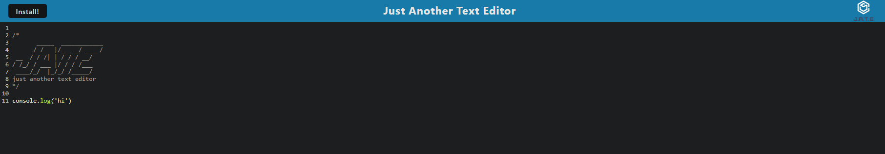

# Text Editor challenge 19

Runs on the browser 

# Table of Contents
- [installation section](#-installation)
- [ guide ](#-guide)
- [  test  ](#-test-instructions)
- [Author](#author)

# Application Image:

# Installation
got to the deployed link or do de npm install on VS code and then an NPM start

#  Guide
He can use it to the check a Text Editor in the browser
# Contribution Guidelines
David Vallejo
# Test 
None

## Author

Born in Monterrey,NL and currently working to become a full-stacl developer

- [David´s Github](https://github.com/Vallejo1194)
- [David's Linkedin](https://www.linkedin.com/feed/)
- 📩[David's Email](mailto:adrian.vallejo94@gmail.com)